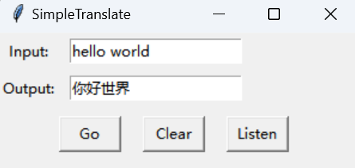
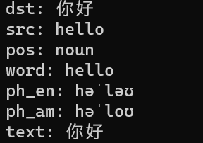

# 简译：Simple Translate

[TOC]

## 简介

> 一款快速查词的桌面小工具
>
> A desktop gadget for quick word search

一直想做一个**极简风格**的桌面翻译框，简单且实用。本项目主要借鉴了两处资源，在这里向开源者表示感谢。

一个是很适合我的基础的基于python语言开发和百度翻译API的桌面翻译应用。

网址：[Muieay/QuickWord: 桌面翻译小工具 (github.com)](https://github.com/Muieay/QuickWord)

其实已经比较符合我的想法了，但是还存在一些地方想根据我自己需求进一步改进：

1. 界面还不够简洁：“配置”没必要放在bar上，并且翻译结果我不想放在框里，这样并不直观；
2. 下方的功能按键显得聊胜于无，“翻译”按键可以用回车键代替，或者可以直接自动翻译（原作者也设置了快捷键 但不知道为什么设置成组合键），“清空”按键可以用一个垃圾桶按钮来替代（或者不要也没关系）；
3. 返回内容只有一个中文释义，显然是不够用的；
4. 不能实现置顶桌面；
5. 还不够大！字体、框都是这样；

主要借鉴其的前端设计。

另一个是基于requests库对网站进行请求和一个可视化的桌面。不过其界面设计的过于花哨了，不太符合我的审美。

主要借鉴其的后端处理，并且在基础上进行维护和改进。

网址：[百度翻译的爬取及可视化_一定要加；的博客-CSDN博客](https://blog.csdn.net/m0_53419397/article/details/116269548)

该作者的分析过程很清晰，不过没有附完整代码，并且附的代码有一点乱，也有点疏忽的地方。而且其获取的内容和API是一样的，只有一个释义，不过最重要的贡献在于使用requests库直接对百度翻译进行爬取请求。所以如何去分析网页响应内容的丰富信息成为最重要的事情。

两位原作者都已经做的很好了，我不过是在其基础上融合发展。

## 配置过程

### 数据来源

本来是打算用官方API来获取翻译内容的，但是返回的结果实在是过于简陋了。对于一个单词只有一个单独的释义，显然是不够用的，所以计划更改获取数据的方式为爬取。

直接从网页上获取内容有很多好处和相应的不利：好处在于网页的响应内容相当丰富，可以获取更多的信息；同时对其他的用户来说，在使用时减少了一些配置过程（比如申请API）。坏处在于存在网站改版的风险，容易被ban，所以可能需要一定的维护，相比于使用官方API来说风险更高，且反应可能相对更慢（可能需要重试多次）。

### 安装execjs库

为了获取post表单里的信息，需要执行对应的JS代码。

其他的库都好说，这个库安装起来有一点麻烦，可参考该网址自行安装：

[execjs的使用 - eliwang - 博客园 (cnblogs.com)](https://www.cnblogs.com/eliwang/p/15245256.html)

Node.js安装参考该网址：

[node.js安装及环境配置超详细教程【Windows系统安装包方式】 - 知乎 (zhihu.com)](https://zhuanlan.zhihu.com/p/442215189)

## 特征开发

### 历史记录

doc文件夹里的history为记录历史记录，query为当前查词记录

### 快捷键操作

#### 唤醒、隐藏

按下`Ctrl+space` 来快速唤醒或隐藏窗口。

#### 查词

按下回车键查词（可能会有一定延迟）

#### 清除

按下`Ctrl+Backspace` 来清除

#### 播放声音

在查词后会自动播放声音，或者可以按`<Esc>`或`<CapsLock>`来播放声音

### 打包

可以用pyinstaller来打包成exe文件让其更方便使用

## 运行示例

在屏幕右下角会出现翻译框，输入查询的单词或短语，点击`Go`或者按下回车键，即可返回相应查询值

在命令行里会输出更多相关信息可以参考

